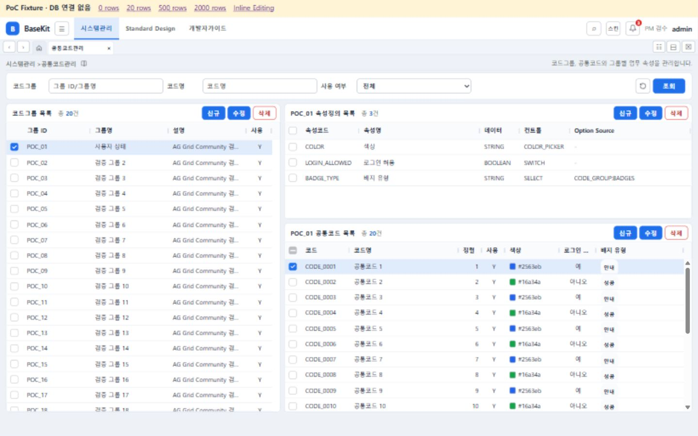

# AG Grid Community 1차 PoC 검수 보고

## Status
POC_REVIEW

## 범위와 상태

기준 `ee921926e436ceb1c2034e9613026378e053697e`, `codex/ag-grid-foundation` 전용 worktree에서 구현·검증. Commit/Push/PR/Merge 없음. AG Grid의 전면 채택이나 전체 화면 전환은 결정하지 않았다.

이 문서의 화면·성능 수치는 1차 PoC 당시 결과다. 이후 공통코드관리 운영 화면은 Inline Batch CRUD로 발전했으며, 현재 Production 경로는 `CodeManagePage → BaseKitDataGrid → gridColumnAdapter.toGridColumns → AG Grid`이다. `MetadataAgGrid`는 개발용 PoC에서만 사용하는 얇은 Wrapper로 `frontend/src/poc/`에 격리했다.

### 1. 버전·라이선스

- `ag-grid-community`, `ag-grid-react`: **36.2.0** 정확한 버전 고정. npm 최신 버전과 공식 문서를 확인했다.
- 설치된 React 19.2.7 / TypeScript 6.0.2. React 19 peer 범위와 AG Grid 36의 TypeScript 최소 5.8.3 조건 충족. TypeScript/build 통과.
- Community는 MIT: 상업적 사용·수정·재배포 가능, 저작권과 라이선스 고지 보존 필요. 별도 Enterprise 라이선스 키 불필요. 직접 패키지와 AG Grid 내부 의존성의 고지를 `frontend/public/licenses/`에 보존하여 빌드 산출물에도 포함한다.
- Community: 정렬, 리사이즈, 행/체크박스 선택, 가상 스크롤, 커스텀 렌더러, 셀 및 Full Row 편집, 기본 Select/Checkbox/Number Editor.
- 사용하지 않는 Enterprise 기능: Row Grouping/Pivot, 내장 Master Detail, Server-Side Row Model, Excel Export, Rich Select, Cell Selection, Batch Editing. BaseKit의 독립 3개 Grid 배치는 Enterprise Master Detail을 사용하지 않는다.
- 기존 Excel 버튼 권한 계약과 핸들러는 그대로이며 이번 PoC에서 Excel 다운로드를 구현하지 않는다.

공식 근거: [호환성](https://www.ag-grid.com/react-data-grid/compatibility/), [MIT 라이선스](https://www.ag-grid.com/eula/community/), [Community/Enterprise](https://www.ag-grid.com/react-data-grid/community-vs-enterprise/), [Full Row Editing](https://www.ag-grid.com/react-data-grid/cell-editing-full-row/).

### 2. 구조와 변경 경계

현재 Production: `CODE_ATTRIBUTE_DEF → toFieldDefinitions → FieldDefinition → BaseKitDataGrid → gridColumnAdapter.toGridColumns → AG Grid Community`

1차 PoC Fixture: `FieldDefinition → poc/MetadataAgGrid → BaseKitDataGrid → 동일 Column Adapter → AG Grid Community`

- `BaseKitDataGrid`: 기존 ProgramDataGrid의 제목·건수·권한·CRUD Toolbar를 재사용하고 내부 GridTable에서 AG Grid API와 선택 동기화를 처리한다.
- `gridColumnAdapter`: 고정 DataTableColumn과 동적 FieldDefinition을 AG Grid ColDef로 변환한다. Row State, 편집·검증·Editor·Renderer도 Production과 PoC에서 동일한 Adapter가 처리한다. 동적 Metadata 컬럼 ID는 고정 업무 컬럼과 충돌하지 않는 공통 Key 계약을 사용한다.
- `ProgramDataGrid`에는 제품 독립적인 선택적 `renderTable` 연결점만 추가했다. 기본값은 기존 DataTable이다. DataTableProps는 타입 export만 추가했다.
- 1차 PoC 당시 기존 MetadataDataGrid는 변경·삭제하지 않았다. PROGRAM, MENU, Standard Design은 기존 Grid를 계속 사용한다.
- **FieldDefinition, CODE 계약, MetadataForm, 권한, Backend, DB, Flyway 변경 없음.** Page는 AG Grid API/ColDef를 import하지 않는다.
- 코드관리 3개 Grid만 신규 Wrapper 사용. 기존 Modal CRUD 유지. 조회 중 overlay와 빠른 Master 전환 시 이전 응답을 버리는 방어를 추가했다.
- 공통 CSS/Theme만 사용. Header 34px, Row 32px, 기존 스킨 색상 변수 사용. Multi-Grid 40:60 / 38:62, 최소 520/180/240px, Message Area 32px 규격 유지.

### 3. 화면 검수 결과

로컬 Vite `grid-poc.html`의 **실제 AppLayout + CodeManagePage**를 브라우저로 조작했다. 데이터는 독립된 메모리 Fixture이며 운영 DB에 대량 샘플을 넣지 않는다. 실제 API 저장까지의 브라우저 종단 검증을 의미하지 않는다.

| 항목 | 확인 결과 |
|---|---|
| 3개 Grid | 코드그룹·속성정의·코드목록 표시, 기존 Toolbar/Modal 유지 |
| 동적 컬럼 | COLOR, LOGIN_ALLOWED, BADGE_TYPE 동시 표시; Color swatch/Boolean/Badge label 확인 |
| Metadata 갱신 | POC_02 선택 시 속성 1개로 축소, POC_01 복원. 기존 속성정의 등록 Modal에서 POC_EXTRA 저장 후 4번째 동적 컬럼 생성 |
| Row 선택 | Master 클릭 선택·Detail 갱신, Detail 행 클릭 선택, Checkbox 선택 후 수정 Modal에서 선택한 CODE_ID 일치 |
| Sort | SORT_ORDER 내림차순에서 20 → 1 숫자 순서 확인 |
| Resize | 코드 컬럼 100 → 165px 확인; 확대 시 가로 스크롤 발생 |
| Scroll | 마우스 세로 스크롤, Ctrl+Home/End, 가로 scrollLeft 345.6px 확인 |
| Empty / Loading | 0건 메시지, Master 변경 중 Detail aria-busy와 조회 overlay 확인 |
| Layout | 1440×900 / 1280×800에서 3개 Grid와 고정 32px Message Area 확인. Header 34, Row 32px 실측 |

### 4. Inline Editing 가능성

독립 Fixture `?mode=editing`에서만 편집을 활성화했다. 코드관리 운영 화면은 읽기전용 Grid와 기존 Modal CRUD를 유지한다.

- 셀 더블클릭 입력 → immutable draft 업데이트 → Dirty 1건 및 행 표시 확인.
- 취소 → 저장 시점의 행 복원 확인.
- Full Row 모드에서 같은 행의 코드명·정렬(42) 동시 변경 및 저장 확인.
- 신규 → 빈 코드명 행 추가 → 저장 검증 실패 → 코드명 입력 → 메모리 저장 / Dirty 0건 확인.
- Validation은 BaseKit callback에서 처리하며 FieldDefinition.required 연결 예를 포함한다. 이번 확인은 필수 코드명·숫자와 로컬 저장 수준이다.
- GridEditing은 opt-in이며 GridApi를 노출하지 않는다. Community 편집 이벤트를 BaseKit callback으로 변환하고 서버 저장·취소·오류 정책은 호출자가 소유한다.
- 후속 실제 Inline CRUD에는 서버 오류 후 복구, 중복·동시성, 행 단위 오류 표시와 저장 트랜잭션 설계가 추가로 필요하다. Enterprise Batch Editing을 대체 구현한 것은 아니다.

### 5. 데이터 규모별 확인

| 데이터 | 결과 |
|---|---|
| 20행 | 초기 렌더·선택·정렬·동적 컬럼·스크롤 정상 |
| 500행 | 최초 코드목록 DOM 16행, 마지막 ROW_500 표시, 스크롤 후에도 DOM 16행 |
| 2,000행 | 최초 DOM 15행, 마지막 ROW_2000과 처음 ROW_1 이동 정상. 실제 마우스 스크롤 시 180~199번 20행만 렌더 |

컬럼 7개(고정 4 + 동적 3)를 포함한 시각/기능 스모크 결과다. 정밀 프레임률/밀리초 Benchmark는 수행하지 않았다. DOM 수는 viewport와 rowBuffer에 따라 달라진다.

### 6. 자동 검증

- `npm run build`: TypeScript 포함 통과.
- `npm run lint`: 통과.
- `npm run backend:test`: **21 tests, 0 failures/errors/skipped**. H2와 설정된 PostgreSQL 통합 테스트 포함. Backend 소스·Migration 변경 없음.
- `node frontend/scripts/test-grid-adapter.mjs`: 숫자/0/empty/Boolean, Color/Badge, 편집 opt-in, 동적 제거, Metadata 불변, Enterprise 의존성 미포함 검사 통과.
- `git diff --check`: 통과.
- Vite의 500kB chunk 경고는 남음. PoC의 JS 산출물은 약 2.01MB / gzip 575kB이며, 정식 채택 시 필요한 모듈 선별 및 지연 로딩 검토가 필요하다.

### 7. 검수 재현

```powershell
npm ci --prefix frontend
npm run dev --prefix frontend -- --host 127.0.0.1 --port 5185
```

- 실제 API 화면: `http://127.0.0.1:5185/baseKit/#/system/codes` (기존 Backend 필요)
- 메모리 검수: `http://127.0.0.1:5185/baseKit/grid-poc.html?rows=20#/system/codes`
- 검수 상단 링크로 0/20/500/2000행·Inline Editing 전환. Fixture는 Vite 개발 전용 별도 entry이며 정상 Production build에 포함하지 않는다.
- Fixture 새로고침 시 모든 변경 초기화. 백엔드 호출 없이 Wrapper·Page 연결을 검증한다.



### 8. 장점·제약 및 다음 결정

- 장점: 기존 Metadata를 유지하며 렌더링 엔진 교체 가능, 행 가상화, 컬럼 리사이즈/정렬, 셀·행 편집 기반 확보.
- 제약: 번들 크기 증가, 라이브러리 API 버전 관리, 일부 고급 기능의 Enterprise 경계. 임의 JSX 고정 컬럼은 정렬 원값을 자동 추론할 수 없으므로 향후 적용 시 BaseKit 공통 값 접근 계약 검토 필요.
- 전면 채택·다른 화면 Migration·서버 Inline CRUD는 미승인/미구현. PoC 검수 후 사용자가 결정한다.

### 9. 변경 파일

- `frontend/package.json`, `frontend/package-lock.json`
- `frontend/src/components/common/DataTable.tsx` (타입 export)
- `frontend/src/components/common/ProgramDataGrid.tsx` (렌더링 연결점)
- `frontend/src/components/grid/BaseKitDataGrid.tsx`
- `frontend/src/poc/MetadataAgGrid.tsx` (현재 PoC 전용 위치)
- `frontend/src/components/grid/gridColumnAdapter.tsx`
- `frontend/src/components/grid/basekitGrid.css`
- `frontend/src/pages/CodeManagePage.tsx`
- `frontend/src/poc/GridPoc.tsx`, `frontend/src/poc/main.tsx`, `frontend/grid-poc.html`
- `frontend/scripts/test-grid-adapter.mjs`
- `frontend/public/licenses/ag-grid-community-LICENSE.txt`, `ag-grid-react-LICENSE.txt`, `ag-stack-LICENSE.txt`, `ag-charts-types-LICENSE.txt`
- `docs/basekit-current-status.md`, `docs/decisions/026-metadata-field-rendering-contract.md`
- `docs/poc/ag-grid-community-poc.md`, `docs/poc/ag-grid-code-management.png`
